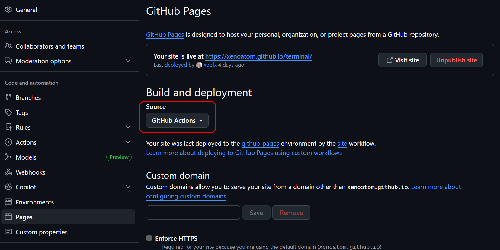

# Publishing with GitHub Actions

Lunet provides an official GitHub Action — [`lunet-io/actions/lunet-build`](https://github.com/lunet-io/actions) — that builds your site and deploys it to **GitHub Pages** in a single step. No manual build scripts, no separate CI configuration — just add a workflow file and push.

## Enable GitHub Pages

Before the workflow can deploy, you must activate GitHub Pages in your repository settings:

1. Go to **Settings → Pages** in your GitHub repository.
2. Under **Build and deployment → Source**, select **GitHub Actions**.



That's it. GitHub will now accept deployments from workflow runs instead of requiring a dedicated branch.

## Add the workflow

Create `.github/workflows/site.yml` in your repository:

```yaml
name: site

on:
  push:
    branches: [main]
  workflow_dispatch:

permissions:
  contents: read
  pages: write
  id-token: write

jobs:
  site:
    runs-on: ubuntu-latest
    environment:
      name: github-pages
      url: ${{ '{{' }} steps.lunet.outputs.page_url {{ '}}' }}
    steps:
      - id: lunet
        name: Build and deploy Lunet site
        uses: lunet-io/actions/lunet-build@v1
```

Push this file to `main` and your site will be built and published automatically.

## What the action does

Behind the scenes, `lunet-build` runs these steps:

1. **Checks out** your repository (with submodules by default).
2. **Installs** the .NET SDK and the `lunet` tool.
3. **Builds** the site by running `lunet build` in your `site/` folder.
4. **Uploads** the output (`.lunet/build/www/`) as a GitHub Pages artifact.
5. **Deploys** the artifact to GitHub Pages.

The deployed URL is available as the `page_url` output.

## Common options

### Custom site path

If your site lives in a folder other than `site/`:

```yaml
- uses: lunet-io/actions/lunet-build@v1
  with:
    site_path: docs
```

### Build another repository

You can build a site from a different repository (useful for organization-level Pages sites):

```yaml
- uses: lunet-io/actions/lunet-build@v1
  with:
    repository: my-org/my-other-repo
    site_path: site
```

### Build only (no deploy)

To upload the Pages artifact without deploying — for example, to add an approval step:

```yaml
- uses: lunet-io/actions/lunet-build@v1
  with:
    deploy_pages: false
```

### Custom build command

```yaml
- uses: lunet-io/actions/lunet-build@v1
  with:
    build_command: "lunet --stacktrace build"
```

## Custom domain

To serve your site under a custom domain (e.g. `example.com`):

1. Follow the [GitHub Pages custom domain guide](https://docs.github.com/en/pages/configuring-a-custom-domain-for-your-github-pages-site).
2. Set `baseurl` in your `config.scriban` to match:

   ```scriban
   site_project_baseurl = "https://example.com"
   ```

The action handles the rest — no `CNAME` file is needed in the build output.

## All inputs

{.table}
| Input | Default | Description |
|---|---|---|
| `repository` | current repo | Repository to checkout (`owner/name`) |
| `ref` | default branch | Git ref (branch, tag, or SHA) |
| `token` | `github.token` | Token for checkout |
| `checkout_path` | `source` | Checkout directory |
| `submodules` | `recursive` | Submodule checkout mode |
| `fetch_depth` | `0` | Fetch depth |
| `dotnet_version` | `10.0.x` | .NET SDK version |
| `lunet_version` | *(latest)* | Lunet tool version range |
| `site_path` | `site` | Site folder inside the repo |
| `build_command` | `lunet build` | Build command |
| `output_path` | `.lunet/build/www` | Output folder (relative to `site_path`) |
| `setup_pages` | `true` | Run `actions/configure-pages` |
| `upload_pages_artifact` | `true` | Upload output as Pages artifact |
| `deploy_pages` | `true` | Deploy to GitHub Pages |

## See also

- [Getting started](getting-started.md) — install Lunet and create your first site
- [CLI reference](cli.md) — `build`, `serve`, and other commands
- [`lunet-io/actions` on GitHub](https://github.com/lunet-io/actions) — action source and changelog
